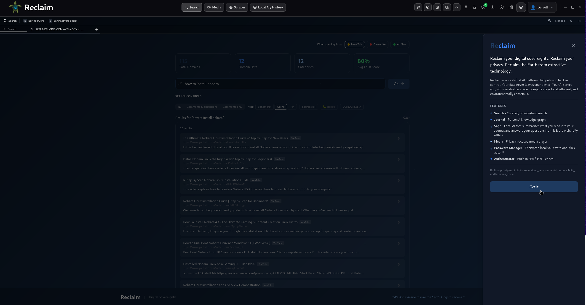
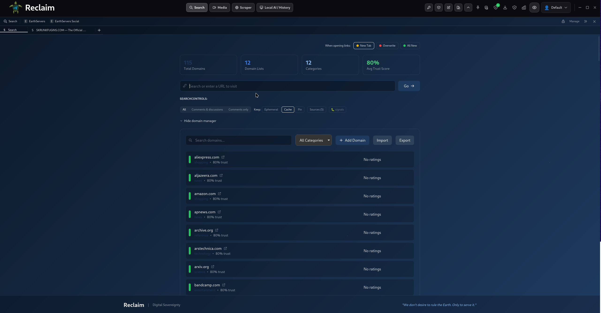
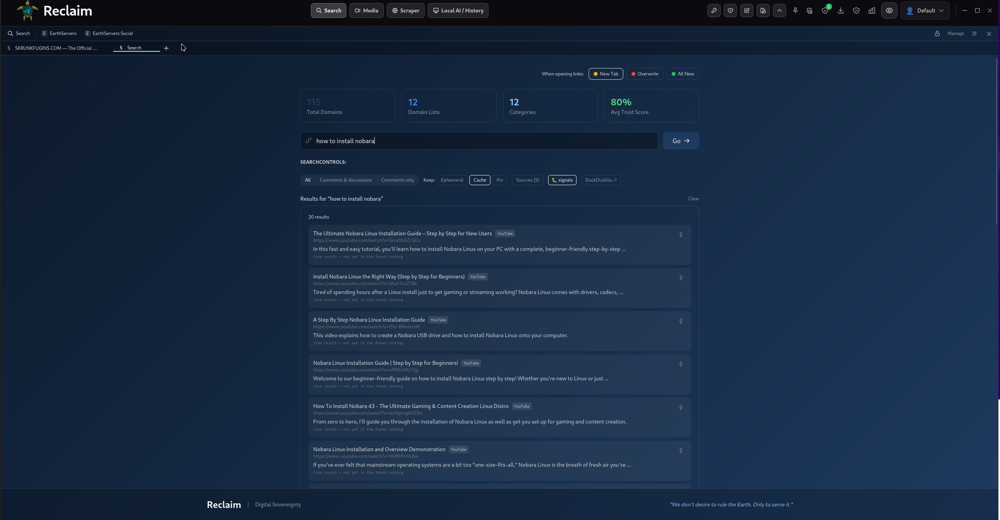

<div align="center">
  <h1>EarthServers Reclaim</h1>
  <p><strong>Reclaim Your Digital Sovereignty</strong></p>
  <p>A privacy-first desktop browser with on-device AI, curated search, manual media saving, and community trust ratings.</p>

  [](https://opensource.org/licenses/MIT)
  [](https://www.rust-lang.org/)
  [](https://tauri.app/)

  <br>

  

  <table>
    <tr>
      <td width="50%"></td>
      <td width="50%"></td>
    </tr>
  </table>
</div>

---

## Mission

> **"We don't desire to rule the Earth. Only to serve it."**

Reclaim puts you back in control of your digital life. Everything runs **locally** — your browsing, your AI, your data. Nothing leaves your device.

## Features

Everything below runs **on your machine**. The only outbound traffic is the pages you load (and, in Research mode, the searches you run) — your data, AI, and indexes never leave the device.

### 🔎 Search & Browser
- **Tabbed WebKitGTK browser** — per‑tab page cache (switching tabs doesn't reload), persistent cookies/sessions, curated/resolved address bar.
- **Password manager + autofill** — an Argon2id‑gated vault (AES‑GCM at rest); detects login forms, offers to save, and autofills credentials.
- **TOTP authenticator** — store 2FA secrets and generate one‑time codes locally (no phone, no cloud).
- **Password‑protected bookmarks** — bookmarks are encrypted at rest, with an optional Argon2id password gate for a private set.
- **NoScript** — JavaScript is blocked by default and trusted **per site** (persistent or session‑only); a web‑process extension blocks untrusted third‑party requests.
- **Privacy protection** — third‑party cookie blocking, tracking prevention (ITP), user‑agent spoofing, and incognito (ephemeral, nothing on disk).
- **Your own search engine** — build a private index from the sites *you* curate and **scrape**, plus community trust/bias ratings on domains. Search your own corpus, not an ad network.
- **Per‑tab search** — every search tab keeps its own query, streamed results, filters and page; switching tabs preserves each search (no re-run), and new tabs start clean.
- **Saved searches & history** — a right‑dock **Searches** panel (and a tab on the Local AI / History page) with saved searches that remember their filters, plus grouped recent‑search history (run / save / remove / clear). Local and per‑profile.

### 🔍 Local Search — "Google, but completely local"
- **Query‑driven local index** — type a query and get fast results that are **scraped, indexed, and grep‑able on your device**. It fuses local SearXNG meta‑search, the web scraper, and the AI curator behind one index (**FTS5 full‑text ⊕ vector embeddings**) with a fusion ranker. The index only ever contains things *you actually searched* — strong privacy by construction.
- **Two‑speed results** — SearXNG‑speed snippets paint instantly, then scraped + indexed results stream in, then the list re‑orders to a **fused ranking** (BM25 ⊕ vector cosine ⊕ SearXNG position ⊕ a private click‑log, via Reciprocal Rank Fusion). The first search for a topic is slow; every search after is instant.
- **Retention ladder** — browse → auto‑cache (TTL'd, no curation cost) → **favorite/pin** (permanent, curated) → archived (summary kept, body dropped) → forgotten. Auto‑GC only ever touches the cheap tiers; pins are protected. Login/credential pages are never cached or indexed.
- **Favorites = pins, one source of truth** — a pin control (distinct from the bookmark star) in the address bar, History, and results, all reading the same tier. A **review‑pinned** panel where the curator *proposes* prune candidates (disuse, age, semantic redundancy) and *you* dispose — pins are never silently removed.
- **Comments & discussions** — filter to comments/discussions and pull posts + comments from **Reddit** and **forums** (Discourse / Stack Exchange / generic) by default, plus **YouTube** and **TikTok** via yt‑dlp. (Instagram/Facebook are best‑effort and **off by default** — public, logged‑out only; an optional, default‑off "use my own session" toggle carries a blunt Terms‑of‑Service warning. No credential automation.)
- **Crawler fan‑in** — pages from your Web Scraper crawl jobs join the same results (read‑only, capped per domain, badged "from crawl").

### 🎬 Media
- **Multi‑pane viewing** — single, split (horizontal/vertical), or quad; each pane is an independent native player.
- **Workspace tabs** — browser‑style media tabs, each with its own queue, panes, and layout.
- **Queue** — drag‑to‑reorder, **shuffle**, repeat, and consecutive autoplay (next item plays in the pane that just finished).
- **Drag & drop** — drop files or whole folders; videos fill panes and queue, image folders expand into the queue.
- **Image slideshow** — shuffle/stagger across panes, fitted on load.
- **Password‑protected playlists** — playlists are encrypted; lock them behind a media password (+ optional OTP).
- **Media downloader** — manually save images/gifs/videos with your own descriptions (for the AI), plus **yt‑dlp** for streaming sites like YouTube. You pick the save location.
- **Enhance (super‑resolution)** — one toolbar button cycles **Off → FSR → AI** for videos *and* photos. FSR (AMD FidelityFX 1.0 as in‑pipeline GL shaders) sharpens on any GPU; **AI (Real‑ESRGAN, fp16 on CUDA)** adds learned detail to ≤720p sources in real time (optional install, see below). Switching is live — no playback restart — and everything runs on‑device.

### 🕸️ Web Scraper
- **Crawl & index** — create a job (base URL, crawl depth, max pages, optional URL pattern + content selectors); it crawls, extracts readable text, and indexes pages for **local full‑text search**.
- **Live status** — jobs run on creation (or via ▶ Run), streaming `pending → running → completed` with a live page count.
- **Opt‑in “Add to AI memory”** — per job, also summarize each scraped page into your knowledge graph so the assistant can use it.

### 🧠 Sage — Local AI (Ollama)
- **Knowledge Curator** — summarizes **what you actually read** (an in‑page viewed‑content bridge captures only text you scrolled into view — comments included only if you reach them), not a blind re‑fetch, into your **Journal** (knowledge graph). Skips homepages/feeds, de‑duplicates, writes a rich summary + a small excerpt. Transparent, unbiased, skips incognito. Its on/off state is remembered **per profile**.
- **AI Assistant** — a private, streaming, multi‑session chat (ChatGPT‑style) grounded in your Journal, media notes, and past conversations. Model auto‑selected by your GPU tier, or pick any installed model.
- **🔬 Web Research mode** — agentic **search + read**: the assistant uses local tool‑calling to `web_search` and `fetch_url`, shows each step (🔎 searching / 📄 reading), then streams a grounded answer that **cites the URLs it actually read**. Searches route through a local **SearXNG** instance when available (fully private), or **DuckDuckGo** as a fallback. All reasoning stays on‑device.
- **Password‑protected tab** — lock the whole Local AI / History tab behind its own unique Argon2id password (separate from the vault, media, and bookmark passwords).

### 🔒 Security (defense‑in‑depth)
Two attacker classes are defended against: a malicious/exploited **web page or renderer**, and a **memory‑corruption bug** in the C/C++ surface (WebKitGTK). Each protection is honestly tagged by how strong a boundary it really is — tripwires aren't sold as walls.
- **Vault unreachable from web content [BOUNDARY].** Decrypted secrets live only in the Rust backend; browsed pages can't call vault commands or enumerate it. Autofill is bound to the page's *real* origin and injected directly into the page — the password never reaches page‑readable JS.
- **Redact‑by‑default [HARDENING].** Password/OTP lists are metadata‑only; a single secret is revealed through one **gated, rate‑limited, audited** path, and OTP codes are generated in the backend so the seed never leaves it. Every vault access is logged.
- **Sandboxing [BOUNDARY].** WebKitGTK renderer sandbox (bubblewrap + seccomp) is on; the `yt‑dlp` helper runs confined (no‑new‑privs + Landlock + seccomp) — write‑limited to your downloads folder.
- **In‑process hygiene [HYGIENE].** Secrets are zeroized on drop, mlock'd, kept out of swap/core dumps; constant‑time secret comparison.
- **Hardened build [HARDENING].** Full RELRO, PIE/ASLR, non‑exec stack, FORTIFY/stack‑protector/CET for bundled C; CI verifies the flags and runs `cargo‑audit`/`cargo‑deny`. Optional GrapheneOS **hardened_malloc** preload (`scripts/build-hardened-malloc.sh`).
- **Security panel.** A right‑dock panel shows live posture (engine isolation — **Servo = safe Rust** vs **WebKit = C/C++**, sandbox/allocator/integrity) and an event feed. An optional, clearly‑labeled **AI assistant is advisory only** — it explains/triages, never authorizes or unblocks, treats logs as untrusted data, and stores its analysis separately from your browsing data.

> **Out of scope:** none of this stops an attacker who already runs code as your user. For that, run Reclaim on a hardened OS base (e.g. [secureblue](https://secureblue.dev)) with full‑disk encryption.

---

## Prerequisites

| Requirement | Version | Notes |
|---|---|---|
| **Rust** | stable (1.77+) | <https://rustup.rs> |
| **Node.js** | 18+ | <https://nodejs.org> |
| **pnpm** | 8+ | `npm i -g pnpm` |
| **Ollama** | latest | *Optional but required for any AI feature* — <https://ollama.com> |
| **yt-dlp** | latest | *Optional* — only for downloading streaming‑site videos |

### System libraries (Linux)

Reclaim is a Tauri 2 app using WebKitGTK 4.1 and GStreamer (for media).

**Fedora / Nobara / RHEL:**
```bash
sudo dnf install -y webkit2gtk4.1-devel gtk3-devel libappindicator-gtk3-devel \
  librsvg2-devel openssl-devel curl wget file \
  gstreamer1-devel gstreamer1-plugins-base-devel \
  gstreamer1-plugins-good gstreamer1-plugins-bad-free gstreamer1-libav
# optional: yt-dlp
sudo dnf install -y yt-dlp
```

**Debian / Ubuntu:**
```bash
sudo apt update && sudo apt install -y libwebkit2gtk-4.1-dev build-essential curl wget file \
  libxdo-dev libssl-dev libayatana-appindicator3-dev librsvg2-dev \
  libgtk-3-dev gstreamer1.0-plugins-base gstreamer1.0-plugins-good \
  gstreamer1.0-plugins-bad gstreamer1.0-libav
# optional: pipx install yt-dlp
```

> macOS / Windows: install Rust + Node + pnpm; Tauri handles the rest. (Primary target is Linux.)

---

## Setup

```bash
git clone https://github.com/earthservers/earthservers-reclaim.git
cd earthservers-reclaim
pnpm install
```

### Enable the AI (Ollama)

The Curator and Assistant talk to a local Ollama daemon. Start it and pull the models:

```bash
# 1. Run the Ollama server (or use the system service / desktop app)
ollama serve

# 2. Curator model (page summaries) — small + fast
ollama pull llama3.2:3b

# 3. Assistant model — pick the tier that fits your GPU VRAM:
ollama pull llama3.2:1b      #  < 3 GB / CPU‑only
ollama pull llama3.2:3b      #  3–6 GB
ollama pull llama3.1:8b      #  6–12 GB   (good default)
ollama pull qwen2.5:14b      #  12–24 GB
ollama pull qwen2.5:32b      #  24 GB+
```

The Assistant auto‑recommends a model from your detected VRAM, but you can pick **any installed model** from the dropdown in the **Local AI** tab. If Ollama isn't running, AI features simply stay idle.

### Web Research mode (optional)

Toggle **Research** in the assistant header to let it search the web and read pages before answering.

- **Tool‑capable model required.** Research uses Ollama tool‑calling — use a model that supports it (e.g. `llama3.1:8b`, `qwen2.5:7b/14b/32b`). Models without tool support fall back to a plain answer with a note.
- **Private search (recommended): SearXNG.** Run a local [SearXNG](https://docs.searxng.org/) with the JSON API enabled and set its URL (default `http://localhost:8888`) in the assistant's search‑settings (⚙). When reachable, all searches stay on your network — the header shows *"Private search via SearXNG ✓"*.
- **Fallback: DuckDuckGo.** Without SearXNG, searches go through DuckDuckGo's HTML endpoint. Either way, only the search query and the pages the model chooses to read leave your machine; the reasoning is fully local.

#### Running SearXNG (optional, for fully private search)

Easiest is a container. SearXNG ships with the JSON API **disabled**, so enable it after the first start. (On Fedora/Nobara use `podman` — it's preinstalled and drop‑in; just use the full image path `docker.io/searxng/searxng`. On Debian/Ubuntu/macOS use `docker`.)

```bash
# 1. Start it (host port 8888 -> container 8080, the app's default URL)
mkdir -p ~/searxng
podman run -d --name searxng \
  -p 8888:8080 \
  -v ~/searxng:/etc/searxng \
  docker.io/searxng/searxng
# (Docker users: `docker run -d --name searxng --restart unless-stopped -p 8888:8080 -v ~/searxng:/etc/searxng searxng/searxng`)

# 2. Enable the JSON API + set a secret key in ~/searxng/settings.yml:
#    server:
#      secret_key: "<any long random string>"
#    search:
#      formats:
#        - html
#        - json

# 3. Apply the change
docker restart searxng

# 4. Verify the JSON API answers
curl 'http://localhost:8888/search?q=test&format=json' | head -c 200
```

Then in Reclaim's assistant, open the search‑settings (⚙) and confirm the URL is `http://localhost:8888`. With Research on, the header shows **"Private search via SearXNG ✓"**. (No Docker? See the [SearXNG install docs](https://docs.searxng.org/admin/installation.html) for the script/source install — same two settings: `secret_key` and `formats: [html, json]`.)

### AI video upscaling (optional, NVIDIA)

The Media player's **Enhance** button always offers **FSR** (works on any GPU,
nothing to install). To unlock the **AI (Real‑ESRGAN)** mode — a neural network
that reconstructs detail in ≤720p video and photos — install the local runtime:

```bash
./scripts/install-ai-upscaler.sh
```

This puts the bundled Real‑ESRGAN model (BSD‑licensed, `resources/aisr/`) plus
the official onnxruntime‑gpu, NVIDIA CUDA runtime and TensorRT libraries (the
same freely‑redistributable PyPI packages PyTorch uses) into
`~/.earthreclaim/aisr` (~4 GB download). Restart Reclaim and the Enhance
button gains the AI mode automatically. Requirements: an NVIDIA GPU with a
current driver. Everything runs locally — the model is inert weights, runtime
telemetry is disabled, and no frame ever leaves your machine. Uninstall by
deleting the directory.

Notes: AI engages on ≤720p sources (where super‑resolution actually matters)
and transparently falls back to FSR above that; if the GPU can't keep up on a
given clip, frames drop smoothly rather than stalling playback. The model runs
as an fp16 TensorRT engine — the **first** AI engage compiles it (one‑time,
can take a few minutes; cached in `~/.earthreclaim/aisr/trt-cache`), and if
TensorRT is missing it falls back to plain CUDA (`EARTH_AISR_TRT=off` forces
that).

---

## Run & Compile

### Development (hot reload)

```bash
pnpm reclaim:x11      # recommended on Linux (forces X11 backend — avoids Wayland/GL quirks)
# or
pnpm reclaim          # default backend
```

The first run compiles the Rust backend (a few minutes); subsequent runs are fast.

### Production build (installable bundle)

```bash
pnpm reclaim:build
```

Bundles are written to `apps/reclaim/src-tauri/target/release/bundle/` (`.deb`, `.rpm`, AppImage, etc.).

### Useful flags
- `EARTH_EMBED=x11` — opt into the legacy X11 page‑surface embed (default is the GTK overlay embed).
- `EARTH_VIDEO_SR=off` — disable the media Enhance feature entirely (no GL elements are created).
- `EARTH_AISR_DIR` — where the AI upscaler runtime lives (default `~/.earthreclaim/aisr`).

#### Security toggles (all default to ON / safe; set to `0` to disable)
- `RECLAIM_WEBKIT_SANDBOX=0` — disable the WebKitGTK renderer sandbox (debugging only).
- `RECLAIM_SANDBOX_HELPERS=0` — disable Landlock/seccomp confinement of helper processes (yt‑dlp).
- `RECLAIM_HARDENED_MALLOC=0` — disable hardened_malloc preload (only active if you built it via `scripts/build-hardened-malloc.sh`; `RECLAIM_HMALLOC_VARIANT=light` for the light variant).
- `RECLAIM_SECURITY_CURATOR=0` — disable the optional advisory AI in the Security panel (the deterministic panel keeps working).

---

## Architecture

```
  REACT UI  (host webview) — App.tsx · WebView · LocalAIHub · EarthMultiMedia · WebScraper · panels
        │  Tauri invoke() / emit() events
        ▼
  RUST BACKEND
  │
  ├─ SEARCH / NAVIGATION
  │    WebView ──invoke('navigate')──> router/mod.rs
  │      ├─ RESOLUTION: LocalCache → P2P(.click) → Federated → Blockchain(.earth) → ICANN
  │      └─ RENDER:  .earth → Servo (separate window)
  │                  else   → browser_overlay (GTK overlay, ONE webview PER TAB,
  │                           shared PERSISTENT WebContext ⇒ cookies/sessions on disk)
  │
  ├─ PAGE ⇄ RUST BRIDGE  (injected content scripts)
  │    page ──postMessage──> browser_surface::configure_page_webview
  │      ├─ reclaimVault   : autofill-request / autosave → vault (Argon2id + AES-GCM)
  │      ├─ reclaimVault   : media-list (img/gif/video)  → MediaPanel
  │      ├─ reclaimCurator : VIEWED text (IntersectionObserver) → browser-viewed-content
  │      └─ noscript:seen  : web-ext .so → per-tab SEEN_ORIGINS → NoScript shield
  │
  ├─ MEDIA (EarthMultiMedia)
  │    multi-pane native players · workspace tabs · queue (reorder/shuffle/repeat) · slideshow
  │    downloader: download_media(url, desc) / download_video_ytdlp → ~/Downloads + media_downloads
  │    encrypted playlists (media password + optional OTP)
  │
  ├─ WEB SCRAPER
  │    create_scraping_job → run_job (crawl: fetch → extract_text → save) → scraped_pages (local search)
  │      └─ opt-in add_to_ai → ai::summarize → memory.journal_page (knowledge graph)
  │
  └─ LOCAL AI  (Ollama @ localhost:11434)
       CURATOR:   browser-viewed-content → curate_viewed_page → ai::curate_viewed (summarize VIEWED text)
                    → memory.journal_page → indexed_pages
       ASSISTANT: LocalAIHub → assistant_chat_stream
                    ├─ retrieve_context() ← indexed_pages · media_downloads · journaled chats
                    └─ SYSTEM_PROMPT + context + history → Ollama /api/chat (stream → assistant-chunk)
       RESEARCH:  assistant_research_stream  (agentic, tool-calling loop, ≤5 steps)
                    ├─ research::search → SearXNG (local, private) or DuckDuckGo
                    ├─ research::fetch  → page text (scraper::extract_text)
                    └─ research-step events → UI ; final answer streamed + sources cited

  STORAGE:  SQLite (earthservers.db)  +  OS keyring (at-rest keys)  +  ~/Downloads/Reclaim
```

Everything above runs **on your machine**. The only outbound calls are the page loads you initiate, web searches/reads in Research mode (via SearXNG or DuckDuckGo), optional GitHub update checks, and Ollama on `localhost`.

---

## Updating

Reclaim checks GitHub Releases on launch and shows a banner if a newer version is published, linking you to the download. To update, grab the latest release from
<https://github.com/earthservers/earthservers-reclaim/releases> (or `git pull` + rebuild if running from source).

---

## Contributing

Issues and PRs welcome. See `CLAUDE.md` for the developer guide, commit conventions, and project layout.

## License

MIT — see [LICENSE](LICENSE).
